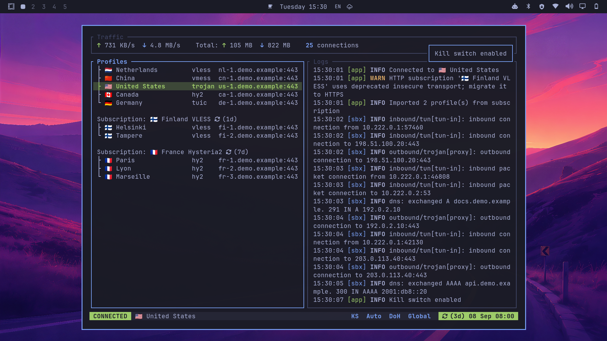

# kvn

[](https://github.com/yarikov/kvn-tui/actions/workflows/ci.yml)
[](https://aur.archlinux.org/packages/kvn-tui-bin)
[](https://github.com/yarikov/kvn-tui/releases/latest)
[](https://www.rust-lang.org)
[](LICENSE)

Keyboard-first TUI for managing VPN connections. It provides a fast, minimal interface for configuring profiles, connecting via [sing-box](https://sing-box.sagernet.org/) and routing traffic.



---

## Contents

- [Features](#features)
- [Supported Protocols](#supported-protocols)
- [Installation (Arch Linux)](#installation-arch-linux)
  - [AUR](#aur)
  - [First launch](#first-launch)
  - [Polkit setup](#polkit-setup-optional)
  - [Kill switch setup](#kill-switch-setup-optional)
  - [Omarchy integration](#omarchy-integration-optional)
  - [Build from source](#build-from-source)
- [Upgrading](docs/upgrading.md)
- [Diagnostics](#diagnostics)
- [Default Key Bindings](#default-key-bindings)
- [Configuration](#configuration)
- [Theme Gallery](docs/themes.md)
- [Architecture](#architecture)
- [Platform Support](#platform-support)
- [Contributing](#contributing)
- [Author](#author)
- [License](#license)

---

## Features

- **Vim-style navigation** — `j`/`k` to move, `gg`/`G` to jump, `?` for help
- **Profiles & subscriptions** — manage profiles and keep subscriptions automatically up to date
- **Geo & service routing** — choose country-based routing modes and ready-made overrides for selected services
- **Kill switch** — block outbound traffic if the VPN connection drops
- **DNS controls** — built-in DoH, DoT, system resolver, strategy, and fake-IP settings
- **Auto-connect & resume** — restore the last connection on startup and after system resume
- **Persistent daemon** — keep the VPN and background services running after detaching the TUI
- **Live insights** — traffic rates, totals, active connections, and combined logs
- **Diagnostics** — check dependencies, configuration, daemon state, and integrations with `kvn doctor`
- **Themes** — choose from [22 bundled color palettes](docs/themes.md)

---

## Supported Protocols

`kvn` supports 11 sing-box outbound protocols. Profiles and subscriptions can be added from
the clipboard using supported share links.

| Protocol | Share-link scheme(s) | Key support |
|----------|----------------------|-------------|
| **VLESS** | `vless://` | REALITY, XTLS Vision, TLS; gRPC, WebSocket, HTTP |
| **VMess** | `vmess://` | Base64 JSON and URI formats; TLS and shared transports |
| **Trojan** | `trojan://` | TLS; gRPC, WebSocket, HTTP |
| **Shadowsocks** | `ss://` | AEAD and AEAD-2022 ciphers; SIP002 and legacy Base64 |
| **Hysteria 2** | `hysteria2://`, `hy2://` | QUIC and Salamander obfuscation |
| **TUIC** | `tuic://` | TUIC v5, congestion control, and UDP relay modes |
| **ShadowTLS** | `shadowtls://` | Versions 1–3 with an inner Shadowsocks connection |
| **AnyTLS** | `anytls://` | TLS-based multiplexing |
| **SOCKS** | `socks://`, `socks5://` | SOCKS4, SOCKS4a, SOCKS5, and optional authentication |
| **HTTP proxy** | `http://`, `https://` | HTTP CONNECT with optional TLS and authentication |
| **SSH** | `ssh://` | Password and private-key authentication |

---

## Installation (Arch Linux)

Optional setup commands modify system or desktop configuration. See
[system integration details](docs/system-integration.md) for installed files,
permissions, and removal instructions.

### AUR

```bash
yay -S kvn-tui-bin
systemctl --user enable --now kvn-tui.service
```

`sing-box` is installed automatically. The user service keeps the daemon
available after login. The package also restores the TUN capabilities on
`/usr/bin/sing-box` automatically after pacman upgrades it.

### First launch

Run `kvn`:

```bash
kvn
```

On first launch, kvn guides you through setup and your first VPN connection.
You’ll need a VPN share link or subscription URL from your provider.

### Polkit setup (optional)

> **Note:** This setup and the kill switch setup below (`kvn setup --killswitch`)
> both add you to the dedicated `kvn-tui` group; reboot once afterwards to
> activate it.

Install the polkit rule to avoid repeated authentication prompts when sing-box
configures per-link DNS through systemd-resolved. The rule grants only the
three required resolved actions to members of the dedicated `kvn-tui` group;
it does not grant NetworkManager permissions:

```bash
sudo pacman -S --needed polkit
sudo kvn setup --polkit
```

Because authorization is group-wide, every process running as
an enrolled user can request those three DNS operations. Skip this setup if you
prefer interactive polkit authorization and do not need unattended auto-connect
or resume reconnects. Enabling auto-connect requires this setup: kvn refuses to
turn it on until the polkit rule is installed and the `kvn-tui` group is active
in the current session.

### Kill switch setup (optional)

The kill switch requires `nftables` and blocks outbound traffic when the VPN is
not active:

```bash
sudo pacman -S --needed nftables
sudo kvn setup --killswitch
```

The kill-switch sudoers rule uses the same dedicated `kvn-tui` group and allows
only the validating helper installed at `/usr/lib/kvn-tui/killswitch-helper.sh`.

Toggle it with `Shift+K` or from the `Space c` settings menu; when enabled, the
status bar shows `KS`. Disabling it with `Shift+K` asks for confirmation first,
so it cannot be turned off by an accidental key press.

> **Note:** If the daemon crashes or cannot start in this state, use the
> emergency command below to restore network access.
>
> ```bash
> kvn disable --killswitch
> ```

### Omarchy integration (optional)

[Omarchy](https://omarchy.org/) is an Arch-based Linux distribution built around
Hyprland. If you do not use it, skip this section. Omarchy 4 or newer is
required.

Set up the standalone [omakvn](https://github.com/yarikov/omakvn) Quickshell bar
plugin together with the `kvn` Apps menu entry, Hyprland shortcuts, and
floating-window rules:

```bash
kvn setup --omarchy
```

The plugin shows live VPN status and provides profile selection and common VPN
controls directly from the bar.

The idempotent installer creates backups before editing user configuration.
Remove them after verification with:

```bash
kvn clean --omarchy
```

This removes only the backups and leaves the active integration unchanged.
Removal instructions are documented in
[`docs/system-integration.md`](docs/system-integration.md#backups-and-removal).

### Build from source

Requires Rust 1.88+, sing-box 1.12+, `base-devel`, `dbus`, and a clipboard tool
(`wl-clipboard` on Wayland or `xclip` / `xsel` on X11).

```bash
yay -S base-devel rust dbus sing-box wl-clipboard
git clone https://github.com/yarikov/kvn-tui.git
cd kvn-tui
```

For a packaged installation with the binary in `/usr/bin` and the systemd user
service included:

```bash
cd pkg/arch
makepkg -si
```

Alternatively, install only the binary from the repository root:

```bash
cargo build --release --locked
sudo install -Dm755 target/release/kvn-tui /usr/local/bin/kvn
sudo setcap cap_net_admin,cap_net_raw+ep "$(command -v sing-box)"
```

The capabilities allow sing-box to use TUN without running kvn as root. The
manual installation uses the automatic detached daemon. If you create a custom
systemd user service, set its `ExecStart` to `/usr/local/bin/kvn --daemon`.

## Diagnostics

```bash
kvn doctor
```

Runs a read-only check of sing-box, configuration, pending package migrations,
the daemon, clipboard, and optional integrations, with remediation hints for
detected problems.

---

## Default Key Bindings

**Navigation**

| Key | Action |
|-----|--------|
| `Ctrl+h` | Focus the previous pane |
| `Ctrl+l` | Focus the next pane |
| `j` / `↓` | Move or scroll down |
| `k` / `↑` | Move or scroll up |
| `gg` / `G` | Go to the first / last item |

**Profiles**

| Key | Action |
|-----|--------|
| `Enter` | Connect to selected profile |
| `e` | Open `profiles.json` in `$EDITOR` |
| `y` | Yank selected profile or subscription |
| `p` | Paste profile or subscription from clipboard |
| `d` | Delete selected profile or subscription |
| `u` / `U` | Update selected subscription / geo |
| `i` / `I` | Cycle subscription / geo auto-update |
| `t` / `T` | Test selected / all profiles |

**Logs**

| Key | Action |
|-----|--------|
| `y` | Copy the focused log record, or every record in the visual selection |
| `Shift+V` | Start a record-wise visual selection |
| `j` / `k` | Extend the visual selection by one complete log record |
| `gg` / `G` | Extend the visual selection to the start / end of the complete log buffer |
| `Esc` | Cancel the visual selection |

**Connection**

| Key | Action |
|-----|--------|
| `r` | Reconnect |
| `s` | Disconnect |
| `Shift+A` | Toggle auto-connect |
| `Shift+K` | Toggle kill switch |

Turning either off asks for confirmation first; turning them on applies right
away. The `Space c` settings screen applies both directions without a dialog.

**Settings**

Press `Space` to open settings. Use `j` / `k` to select an item, `h` / `l` to
change its draft value, and `Enter` to apply all changes on the current screen.

| Key | Action |
|-----|--------|
| `Space` | Open settings menu |
| `Space c` | Connection settings |
| `Space d` | DNS settings |
| `Space i` | Interface settings |
| `Space r` | Routing settings |

**Dialogs**

| Key | Action |
|-----|--------|
| `h` / `l`, `←` / `→` | Change selected value |
| `Enter` | Confirm selection or changes |
| `y` / `n` | Confirm / cancel the action |
| `q` / `Esc` | Cancel dialog |

**Application**

| Key | Action |
|-----|--------|
| `q` / `Esc` | Detach the TUI from the main screen; in a dialog, cancel it (`Esc` cancels an active log selection first) |
| `Ctrl+C` | Stop the daemon, disconnect the VPN, and exit completely |
| `?` | Open or close help |

On terminals supporting the Kitty keyboard protocol, letter shortcuts follow
their physical US key positions regardless of the active keyboard layout.

---

## Configuration

Configuration is stored in `~/.config/kvn-tui/profiles.json`. Press `e` to edit
it in `$EDITOR`; invalid configuration is rejected when reloaded.

See the [configuration guide](docs/configuration.md) for the JSON structure,
advanced DNS and routing, validation, migrations, and runtime file locations.

---

## Architecture

`kvn` is built with Rust 2024 on top of sing-box, with a persistent daemon and a
TEA-style core. See the [architecture overview](docs/architecture.md) for the
technology stack and design highlights.

---

## Platform Support

Arch Linux and Omarchy are the officially supported platforms. The project may
compile and run on other Linux distributions, but their installation and system
integration are not tested or maintained by the project.

## Contributing

Contributions are welcome, including support for other distributions from users
who can test and help maintain it. Before opening a pull request, read
[CONTRIBUTING.md](CONTRIBUTING.md) for branch naming, Conventional Commit and
pull request title requirements, testing, and coverage expectations. Pull
request titles are used in generated release notes.

## Author

Created and maintained by [Dmitry Yarikov](https://github.com/yarikov) — <dmitry@yarikov.com>.

If `kvn` saves you time, you can [buy me a coffee](https://web.tribute.tg/d/QbU) ☕

## License

MIT
